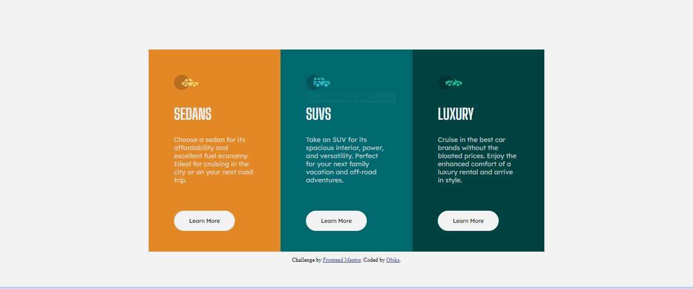

# Frontend Mentor - 3-column preview card component solution

This is a solution to the [3-column preview card component challenge on Frontend Mentor](https://www.frontendmentor.io/challenges/3column-preview-card-component-pH92eAR2-). Frontend Mentor challenges help you improve your coding skills by building realistic projects. 

## Table of contents

- [Overview](#overview)
  - [The challenge](#the-challenge)
  - [Screenshot](#screenshot)
  - [Links](#links)
- [My process](#my-process)
  - [Built with](#built-with)
  - [What I learned](#what-i-learned)
  - [Continued development](#continued-development)
  - [Useful resources](#useful-resources)
- [Author](#author)
- [Acknowledgments](#acknowledgments)

## Overview

### The challenge

Users should be able to:

- View the optimal layout depending on their device's screen size
- See hover states for interactive elements

### Screenshot

### Links

- Solution URL: []
- Live Site URL: [obiks.github.io/card]

## My process
Started with positioning my html file in order to know how my styling would look like.
Tried as much as possible to reduce my styling code, though at the end it became more... (to work on it on my next project)

### Built with

- Semantic HTML5 markup
- CSS custom properties

### What I learned

I learnt how to set up media queries for both mobile and desktop view

### Continued development

My major continued development is to complete a website without the help of a framework, and I am really working towards that.

### Useful resources

- [CSS FOR PROFESSIONALS](ebook) - This is my major ebook when it comes to css styling. You can check it out.

- [W3SCHOOLS]](https://www.w3schools.com/css/css_rwd_mediaqueries.asp) - i was able to do some media query after reading the content on the website

## Author

- Frontend Mentor - [@Obiks](https://www.frontendmentor.io/profile/Obiks)
- Twitter - [@Obiks_Onyis](https://www.twitter.com/Obiks_Onyis)

## Acknowledgments

I really appreciate everyone in the Softamplify Tech community for their assistant. God bless you all

